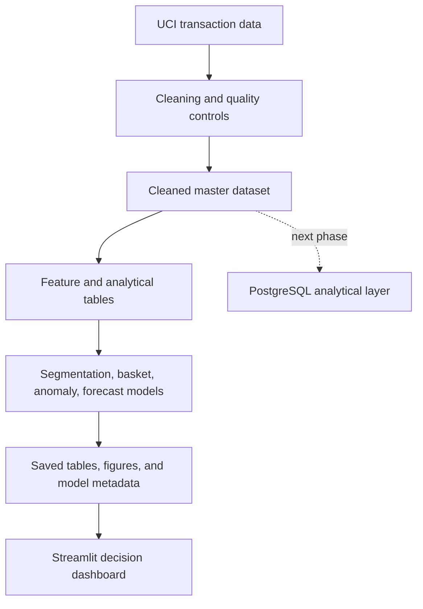

# RetailIQ: AI-Powered Retail Financial Intelligence

RetailIQ is an end-to-end retail analytics project that converts transaction-level data into financial, customer, product, anomaly, and revenue-forecasting insights. It combines auditable business rules, machine learning, deep learning experiments, and an interactive Streamlit dashboard.

> Current status: the local analytics and dashboard MVP are complete. PostgreSQL integration and cloud deployment are the next implementation phases.

## Business objectives

RetailIQ is designed to help a retail decision-maker answer five practical questions:

1. Which customers are active, valuable, inactive, or strategically important?
2. Which products generate revenue, sell together, or show signs of inactivity?
3. Which invoices and transaction lines require financial or operational review?
4. What daily revenue should the business expect over the next 30 days?
5. Which actions should Finance, Customer Operations, and Merchandising prioritise?

All monetary values in this project are reported in pounds sterling (GBP, £).

## Current project status

| Workstream | Status | Main output |
|---|---:|---|
| Data cleaning and quality controls | Complete | Auditable cleaned transaction master and data-quality flags |
| Exploratory data analysis | Complete | Customer, product, revenue, lifecycle, cohort, and basket insights |
| Customer segmentation | Complete | Customer features, RFM analysis, K-Means segments, and profiles |
| Market-basket analysis | Complete | Association rules using support, confidence, and lift |
| Anomaly detection | Complete | Prioritised invoice-review cases from model and rule-based signals |
| Revenue forecasting | Complete | Baseline, XGBoost, and LSTM comparison plus a 30-day forecast |
| Streamlit dashboard | Complete locally | Five decision-oriented dashboard pages |
| PostgreSQL analytical layer | Planned next | Reusable SQL schema, views, and business queries |
| Cloud deployment | Planned | Hosted application and managed data layer |

## Key results

| Area | Result |
|---|---|
| Cleaned transaction master | 1,033,036 rows after exact-duplicate removal, with original records retained through documented classifications and flags |
| Customer modelling population | 5,839 eligible customers after documented exclusions |
| Customer segmentation | Three K-Means segments, supported by RFM and behavioural profiles |
| Market-basket matrix | 34,497 invoices × 1,000 products, with 675,889 non-zero basket entries |
| Anomaly review queue | 1,009 invoice cases: 267 P1, 517 P2, and 225 P3 |
| Forecast test period | 91 complete daily observations from 1 September to 30 November 2011 |
| Selected forecasting model | Tuned XGBoost raw-target model |
| Selected-model test WAPE | 25.287% versus 31.138% for the same-weekday baseline |
| Forecast improvement | Approximately 18.8% lower WAPE than the baseline |
| Future forecast | Recursive 30-day daily revenue forecast with empirical uncertainty estimates |

Model-generated anomalies are review candidates, not confirmed fraud. Product inactivity is also treated as a decision-support signal rather than proof that a product was discontinued.

## Dataset

The project uses the **UCI Online Retail II** dataset, which contains transactions for a UK-based non-store retailer between 1 December 2009 and 9 December 2011.

- Source: [UCI Machine Learning Repository — Online Retail II](https://archive.ics.uci.edu/dataset/502/online%2Bretail)
- DOI: [10.24432/C5CG6D](https://doi.org/10.24432/C5CG6D)
- Creator: Daqing Chen
- Source licence: [CC BY 4.0](https://creativecommons.org/licenses/by/4.0/)
- Raw observations: 1,067,371 transaction lines

The raw dataset is not required to be committed to Git. Place locally downloaded source files under `data/raw/`, then run the notebooks in their documented order to reproduce processed artifacts.

## Solution architecture



The dashboard reads saved, validated artifacts instead of retraining models on each page load. This keeps the application responsive and separates modelling from presentation.

## Analytical workflow

### 1. Data cleaning and quality

- Standardise data types, dates, customer identifiers, and stock codes.
- Remove exact duplicate rows while preserving the raw source separately.
- Recalculate line revenue as `Quantity × Price`.
- Classify sales, cancellations, postage, adjustments, discounts, charges, tests, bad debt, and review-required rows.
- Preserve genuine product codes such as `PADS`; do not classify alphabetic codes automatically.
- Create missing-value, rule-violation, extreme-value, cancellation, and reversal-pair flags.

### 2. Exploratory analysis

- Revenue and order trends by time and geography.
- Customer acquisition and cohort retention.
- Product ABC contribution and lifecycle analysis.
- Inactive and low-frequency product candidates using complete observation periods.
- Cancellation and financial-activity analysis.

### 3. Customer intelligence

- Engineer recency, frequency, monetary value, average order value, units purchased, unique products, and cancellation-rate features.
- Create interpretable RFM scores and business segments.
- Transform skewed values, scale features, and fit K-Means clustering.
- Compare candidate cluster counts with inertia, silhouette score, cluster size, and stability checks.

### 4. Market-basket analysis

- Build a sparse invoice-product basket from valid product sales.
- Mine frequent itemsets and association rules.
- Rank actionable relationships with support, confidence, lift, and basket count.

### 5. Anomaly detection

- Split development and final test data chronologically.
- Compare an Isolation Forest ensemble with transparent rule-based baselines.
- Assess temporal stability, novelty effects, seed sensitivity, and ensemble robustness.
- Aggregate anomalous lines into invoice cases with P1–P3 priorities, owners, reasons, and recommended actions.

### 6. Revenue forecasting

- Aggregate clean sales into a continuous daily time series.
- Exclude the incomplete final month from backtesting.
- Use chronological training, validation, and untouched test periods.
- Compare a same-weekday four-week baseline, tuned XGBoost, and a 30-day-sequence LSTM.
- Select the deployment model primarily by WAPE and produce a recursive 30-day forecast.

## Forecast test results

| Model | MAE (£) | RMSE (£) | WAPE | sMAPE | Bias |
|---|---:|---:|---:|---:|---:|
| Tuned XGBoost Raw Target | 9,800.317 | 14,121.721 | 25.287% | 51.345% | -2.675% |
| Same-Weekday 4-Week Average | 12,068.298 | 16,978.475 | 31.138% | 33.967% | -12.418% |
| LSTM 30-Day Sequence | 20,272.255 | 27,115.922 | 52.306% | 85.758% | -50.139% |

The same-weekday method is the mandatory benchmark. XGBoost is selected because it has the lowest test WAPE; the LSTM is retained as a documented deep-learning experiment rather than the deployment model.

## Dashboard

The Streamlit application provides:

1. **Customer Intelligence** — segments, RFM behaviour, value, and customer drill-downs.
2. **Product and Basket Intelligence** — product lifecycle, contribution, and association rules.
3. **Anomaly Monitor** — case priorities, owners, invoice details, and monitoring trends.
4. **Revenue Forecasting** — model comparison, test predictions, and future estimates.
5. **Business Recommendations** — cross-workstream findings translated into actions.

## Repository structure

retail-financial-intelligence/
├── dashboard/
│   ├── app.py
│   ├── pages/
│   └── utils/
├── data/
│   ├── raw/                 # Local source data; normally not committed
│   └── processed/           # Generated cleaned and analytical datasets
├── models/                  # Fitted artifacts and model metadata
├── notebooks/               # Cleaning, EDA, segmentation, basket, anomaly, forecast
├── reports/
│   ├── figures/
│   └── tables/
├── scripts/                 # Validation and reproducibility utilities
├── src/                     # Reusable feature and modelling modules
├── README.md
├── requirements.txt
└── requirements-dev.txt


The future SQL phase will add `sql/schema.sql`, `sql/analytics_queries.sql`, and documented load scripts without replacing the validated flat-file pipeline immediately.

## Local setup

Run these commands from the repository root in PowerShell:

```powershell
py -m venv .venv
.\.venv\Scripts\Activate.ps1
python -m pip install --upgrade pip
python -m pip install -r requirements.txt
```

To reproduce notebooks and train models, install the development dependencies too:

```powershell
python -m pip install -r requirements-dev.txt
```

If PowerShell blocks virtual-environment activation, use the existing VS Code interpreter selector or run commands explicitly with `.\.venv\Scripts\python.exe`.

## Run and validate the dashboard

Validate required dashboard artifacts first:

```powershell
python scripts/validate_dashboard_artifacts.py
```

Start Streamlit:

```powershell
python -m streamlit run dashboard/app.py --browser.gatherUsageStats false
```

Run the command from the repository root so imports such as `dashboard` and `src` resolve correctly.

## Dependency files

- `requirements.txt` contains only the packages needed to run the dashboard and load its saved artifacts.
- `requirements-dev.txt` includes the runtime file plus notebook, EDA, market-basket, XGBoost, and TensorFlow dependencies.
- Exact environment versions should be captured only from the verified working virtual environment rather than guessed.

To record the currently installed environment after validation:

```powershell
python -m pip freeze > requirements-lock.txt
```

Keep `requirements.txt` as the readable direct-dependency list; use the lock snapshot when exact reproduction of the verified environment is required.

## Limitations

- The source data covers one historical retailer and does not include product cost, margin, inventory-on-hand, marketing exposure, or verified fraud labels.
- Customer and product labels are analytical interpretations, not causal conclusions.
- Association rules show co-purchase patterns, not causation.
- Isolation Forest output requires human review and must not be described as confirmed fraud.
- Forecast uncertainty is based on validation residuals and is not a formal probabilistic guarantee.
- The future 30-day forecast is recursive, so uncertainty increases with forecast horizon.
- The current application uses local artifacts; database integration, authentication, automated retraining, and cloud monitoring remain future work.

## Next implementation phases

1. Add a PostgreSQL star-style analytical schema and reusable SQL business queries.
2. Load validated processed tables into PostgreSQL and add database-backed dashboard loaders.
3. Containerise and deploy the Streamlit application.
4. Add CI checks for imports, artifact schemas, dashboard smoke tests, and data-quality validations.
5. Add model and data-drift monitoring before any production use.

## Author

**Annapoornam Karthikeyan**  


## Dataset citation

Chen, D. (2012). *Online Retail II* [Dataset]. UCI Machine Learning Repository. https://doi.org/10.24432/C5CG6D
