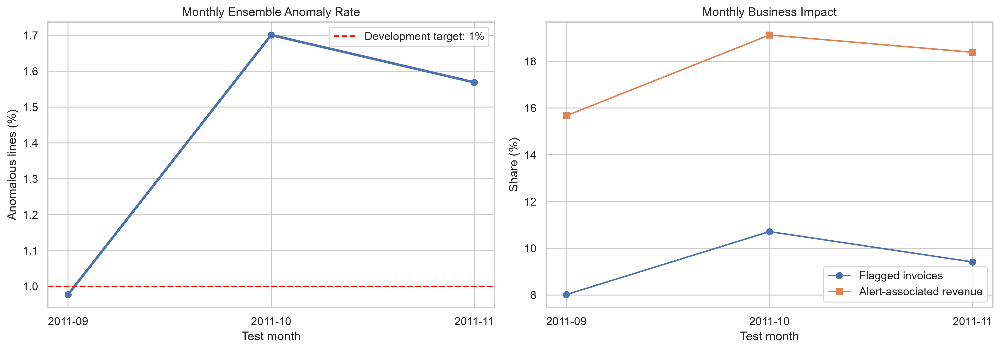
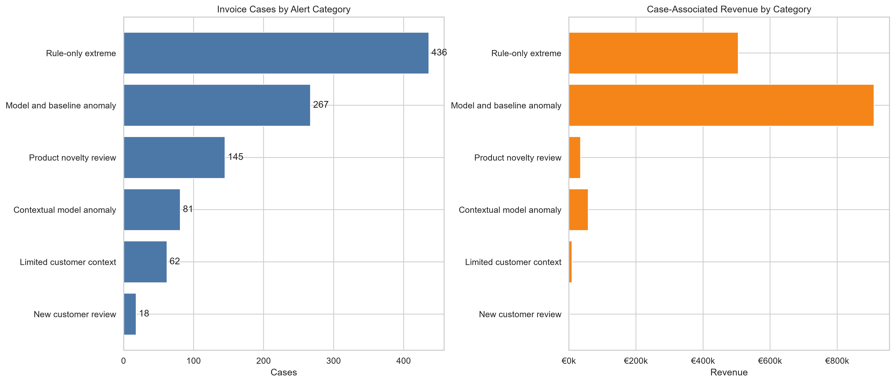
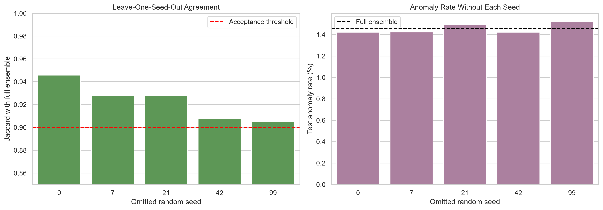
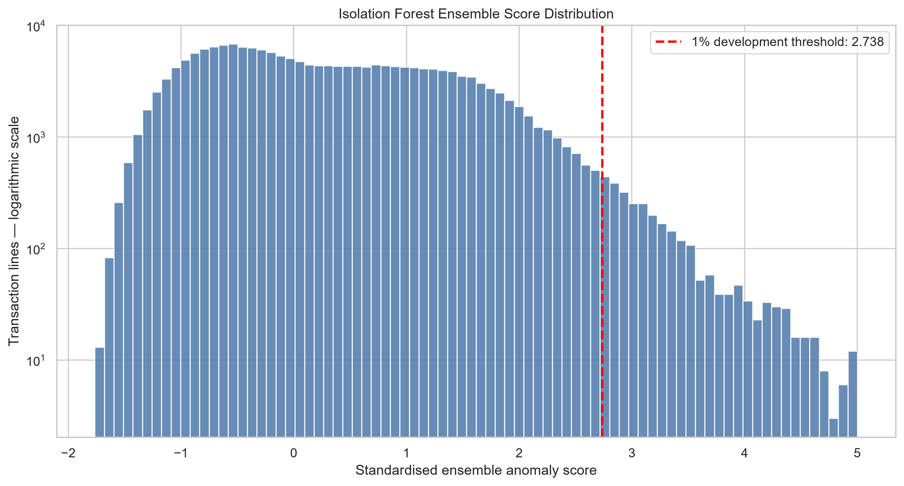

# RetailIQ Anomaly Detection Report

## Executive summary

RetailIQ uses an unsupervised Isolation Forest ensemble to identify unusual
sale transaction lines for financial and operational review.

The independent test period contains 187,819 transaction lines from
September through November 2011. The model identified
2,737 anomalous lines, representing
1.46% of the test population.

The line-level alerts were consolidated into 1,009 invoice-level
cases. Of these, 267 require immediate review, 517 require
financial review and 225 are monitoring cases.

## Data scope

- Development period: December 2009 through August 2011
- Independent test period: September through November 2011
- Test rows: 187,819
- Partial December 2011 data: excluded from evaluation
- Population: valid product-sale transactions
- Exact reversal pairs and critical data-quality failures: excluded

## Methodology

The solution combines two complementary detection methods:

1. A transparent statistical baseline based on extreme transaction values.
2. A five-seed Isolation Forest ensemble for contextual and multivariate
   anomalies.

The model uses 17 numerical features describing transaction value, quantity,
price, invoice context, product history, customer history and transaction
timing.

No categorical encoder was required because identifiers such as Invoice,
StockCode, CustomerID and TransactionType were not passed directly into the
model. No feature scaling was required for the tree-based Isolation Forest.

## Model configuration

- Algorithm: Isolation Forest ensemble
- Number of models: 5
- Random seeds: 0, 7, 21, 42 and 99
- Trees per model: 250
- Maximum samples per tree: 256
- Development alert threshold: 1%
- Missing-value treatment: median imputation
- Evaluation approach: chronological holdout

## Test results

- Model anomaly lines: 2,737
- Test anomaly rate: 1.46%
- Model-flagged invoices: 616
- Total actionable invoice cases: 1,009
- P1 cases: 267
- P2 cases: 517
- P3 cases: 225

## Model stability

The five-model ensemble was evaluated using leave-one-model-out sensitivity
testing.

- Minimum Jaccard similarity: 0.9051
- Minimum Adjusted Rand Index: 0.9480
- Minimum anomaly-score correlation: 0.9994

These results show that the ensemble produces substantially more stable alerts
than relying on a single random seed.

## Alert interpretation

| Priority | Alert category | Recommended owner | Action |
|---|---|---|---|
| P1 | Model and baseline anomaly | Finance and Operations | Review immediately |
| P2 | Rule-only extreme | Finance Control | Validate the financial transaction |
| P2 | Contextual model anomaly | Finance Analytics | Investigate unusual transaction context |
| P3 | Product novelty review | Merchandising | Confirm new or unusual product activity |
| P3 | Limited customer context | Data Quality / Customer Operations | Investigate missing customer information |
| P3 | New customer review | Customer Operations / Credit Control | Monitor new-customer activity |

## Business recommendations

1. Investigate P1 cases first because both detection methods identified them.
2. Reconcile P2 financial cases against invoices, prices, quantities and
   accounting records.
3. Route product-novelty alerts to merchandising instead of treating them as
   confirmed errors.
4. Resolve missing CustomerID cases to improve traceability.
5. Record review outcomes to create labelled data for future supervised model
   evaluation.
6. Monitor anomaly rates monthly and investigate material changes in the alert
   rate.

## Limitations

- The dataset does not contain confirmed anomaly or fraud labels.
- Alerts represent unusual activity, not confirmed fraud, error or loss.
- The development threshold is operational rather than label-optimised.
- New products and missing customer identifiers can generate legitimate
  novelty alerts.
- December 2011 is incomplete and therefore excluded from model evaluation.
- Model performance should be reassessed after analyst review outcomes become
  available.

## Partial-month exclusion

December 2011 contains only a partial month of transaction data. It was
excluded from model development, threshold selection, validation and final
test evaluation to prevent misleading comparisons.

The December records remain available in the cleaned master dataset for future
monitoring.

## Visualisations

## Output artifacts

The project exports:

- line-level anomaly scores;
- flagged transaction lines;
- prioritised invoice cases;
- alert-category summaries;
- monthly monitoring metrics;
- model-stability results;
- the serialised five-model ensemble;
- model metadata and feature definitions.
