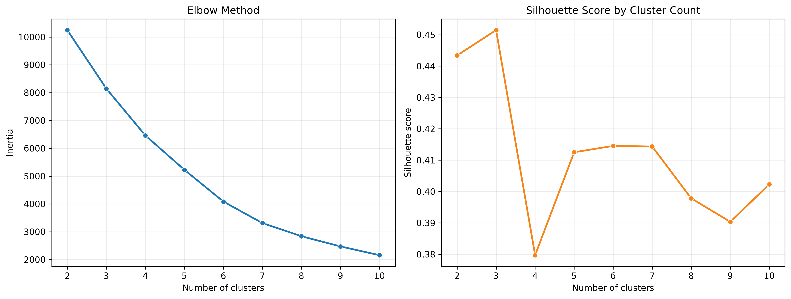
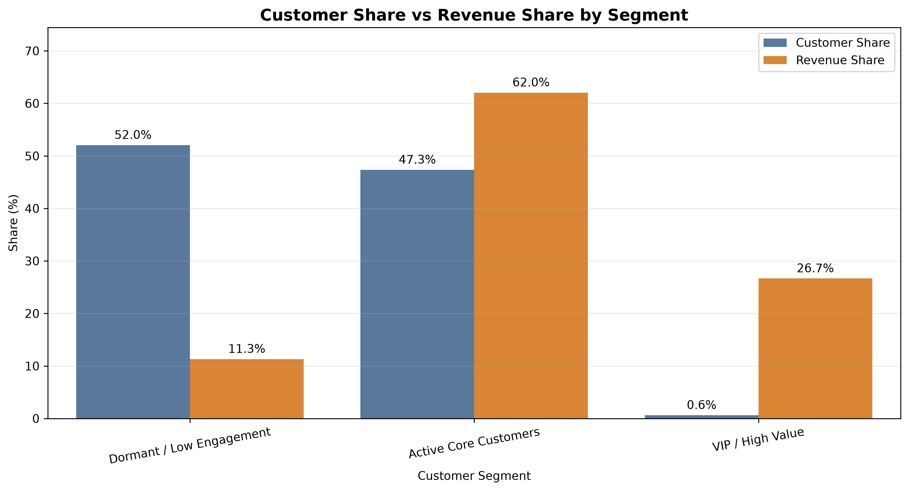
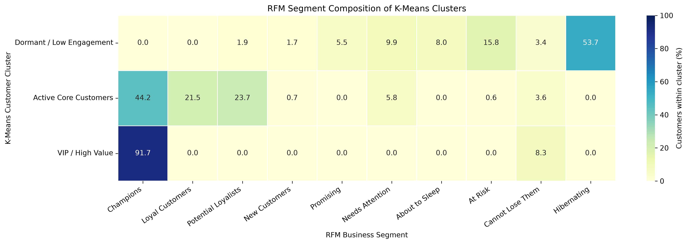

## Customer Segmentation — Final Findings

### Executive Summary

RetailIQ’s customer segmentation analysis evaluated 5,839 customers using Recency, Frequency and net Monetary value. The RFM variables were transformed using Yeo–Johnson transformation, standardized and clustered using KMeans.

The final model identified three commercially meaningful customer groups:

Customer segment	Customers	Customer share	Revenue share
Dormant / Low Engagement	3,039	52.05%	11.31%
Active Core Customers	2,764	47.34%	62.04%
VIP / High Value	36	0.62%	26.65%

The analysis shows a strong concentration of value. Active Core and VIP customers together represent 47.96% of customers but generate 88.69% of net customer revenue. The VIP segment alone contributes more than one-quarter of revenue despite containing only 36 customers.

The principal business opportunity is therefore to protect VIP relationships, develop Active Core customers toward higher value and use selective win-back campaigns for Dormant customers. The final three-cluster solution achieved a silhouette score of 0.4515 and remained highly consistent across multiple random seeds.

### Method

Customer segmentation was performed using Recency, Frequency and net Monetary value. Exact reversal sales were excluded from behavioural features, while cancellations were retained when calculating net customer value.

The RFM variables were transformed using Yeo-Johnson, standardized and clustered using K-Means. RFM scores from 1 to 5 were also created separately to provide explainable business segments.

### Model selection

Three clusters were selected based on statistical quality, stability and business usefulness.

* Final silhouette score: **0.4515**
* Minimum Adjusted Rand Index across stability tests: **0.9853**
* Average Adjusted Rand Index: **0.9971**
* Four of five random-seed tests produced identical clusters

These results indicate that the three-cluster solution is reasonably separated and highly stable.

### Cluster 0 — Dormant / Low Engagement

* Customers: **3,039**
* Customer share: **52.05%**
* Revenue share: **11.31%**
* Median recency: **373 days**
* Median frequency: **1 order**
* Median net monetary value: **368.35**

This is the largest customer group but contributes a relatively small share of revenue. Most customers purchased infrequently and have not purchased recently.

**Recommended actions:** low-cost reactivation campaigns, personalized reminders, limited win-back incentives and suppression of unresponsive customers after testing.

### Cluster 1 — Active Core Customers

* Customers: **2,764**
* Customer share: **47.34%**
* Revenue share: **62.04%**
* Median recency: **27 days**
* Median frequency: **7 orders**
* Median net monetary value: **2,079.18**

This cluster represents the main active customer base and generates most of the company’s customer revenue.

**Recommended actions:** loyalty benefits, personalized cross-selling, repeat-purchase recommendations, early product access and retention monitoring.

### Cluster 2 — VIP / High Value

* Customers: **36**
* Customer share: **0.62%**
* Revenue share: **26.65%**
* Median recency: **4.5 days**
* Median frequency: **71 orders**
* Median net monetary value: **72,142.95**

A very small group generates more than one-quarter of net customer revenue. Their exceptionally high order frequency, volume and monetary value suggest strategic or wholesale-style purchasing behaviour.

**Recommended actions:** dedicated account treatment, priority inventory allocation, proactive service, customized commercial offers and individual cancellation monitoring.

The high revenue concentration also creates dependency risk. Losing only a few customers from this group could materially affect revenue.

### RFM and K-Means interpretation

K-Means provides three broad data-driven customer groups, while RFM scoring provides more detailed business-action categories such as Champions, Loyal Customers, At Risk and Hibernating.

The two methods are complementary:

* K-Means summarizes overall customer structure.
* RFM segments identify specific retention and marketing actions.
* Customers within the VIP cluster can still require different treatment depending on whether they are Champions or Cannot Lose Them.
* Customers in the dormant cluster can be prioritized using their previous monetary contribution.

## Cluster Selection

The silhouette score supports three clusters as the most balanced and interpretable solution.

## Customer and Revenue Contribution

The VIP segment represents only 0.62% of customers but generates 26.65% of net revenue.

## RFM and KMeans Comparison

RFM provides rule-based customer labels, while KMeans identifies behavioural groups from continuous RFM variables.

## Customer Cluster Visualization

[Open the interactive 3D visualization](figures/customer_segmentation/customer_clusters_3d.html)

### Business Recommendations
#### VIP / High Value

The 36 VIP customers generate 26.65% of customer revenue, making them commercially important despite representing only 0.62% of the customer base.

 ##### Recommended actions:

Assign priority service and proactive account management.
Provide early access to new products and high-demand inventory.
Offer personalized product recommendations based on purchase history.
Monitor changes in order frequency, recency and cancellation activity.
Avoid broad discounts that may reduce margin without increasing retention.
Track revenue concentration risk because losing a few VIP customers could materially affect total revenue.

#### Active Core Customers

Active Core Customers account for 47.34% of customers and 62.04% of revenue. This segment is the company’s largest dependable revenue base.

##### Recommended actions:

Introduce loyalty rewards based on repeat purchases or cumulative spend.
Use cross-selling and product-bundle recommendations to increase basket value.
Send replenishment or reorder reminders based on purchase intervals.
Identify high-potential customers approaching VIP-level frequency or monetary value.
Use targeted promotions instead of uniform discounts.
Encourage customers to explore additional product categories.

#### Dormant / Low Engagement

Dormant customers represent 52.05% of customers but only 11.31% of revenue. Their high recency and low order frequency indicate limited recent engagement.

##### Recommended actions:

Run controlled win-back campaigns with time-limited offers.
Personalize messages using previously purchased products or categories.
Separate historically valuable dormant customers from one-time low-value buyers.
Test campaigns on small customer groups before expanding them.
Compare campaign revenue with discount and communication costs.
Reduce repeated marketing activity for customers who remain inactive after several attempts.

#### Ongoing Segment Management

Customer segments should be recalculated regularly because customer behaviour changes over time.

RetailIQ should monitor:

Customer movement between segments.
Segment-level revenue and customer share.
Changes in average recency and order frequency.
Cancellation rates by customer segment.
VIP revenue concentration.
Conversion from Active Core to VIP.
Reactivation rates among Dormant customers.

The segmentation results should guide marketing and customer-management decisions, but campaign effectiveness should be validated through controlled experiments or A/B testing.

### Model Stability

The number of clusters was evaluated using both the elbow method and silhouette score for values of (k) from 2 to 10. The three-cluster solution produced the highest silhouette score while maintaining interpretable and commercially meaningful customer groups.

The final model was tested using random seeds 0, 7, 21, 99 and 123.

Stability measure	Result
Final silhouette score	0.4515
Average silhouette score	0.4512
Minimum Adjusted Rand Index	0.9853
Average Adjusted Rand Index	0.9971
Maximum Adjusted Rand Index	1.0000
Final VIP cluster size	36 customers
Smallest cluster range across tests	22–36 customers

Four of the five tested seeds reproduced exactly the same clustering assignment, with an Adjusted Rand Index of 1.0000. The remaining seed produced a very similar solution with an Adjusted Rand Index of 0.9853.

These results indicate that the selected segmentation is highly stable with respect to KMeans initialization. The small VIP cluster is therefore not simply the result of one random model run. It reflects a persistent group of unusually frequent and high-value customers.

However, initialization stability does not guarantee that customer behaviour will remain unchanged. The model should be monitored over time for changes in cluster size, cluster centres, silhouette score and business interpretation.

### Limitations

The analysis is based only on observed transaction history. The first recorded purchase may not represent the customer’s true acquisition date. Customer demographics, acquisition channels, product costs and profit margins are unavailable.

The VIP/wholesale interpretation is inferred from transaction volume and must be validated with business information. Cluster labels are business interpretations; numerical cluster IDs themselves have no inherent meaning.

### Conclusion

RetailIQ has three commercially distinct customer groups: a large dormant population, an active core generating most revenue and a very small high-value group with disproportionate financial importance.

The recommended strategy is to reactivate selected dormant customers, retain and grow active core customers, and protect high-value relationships through proactive account management.
