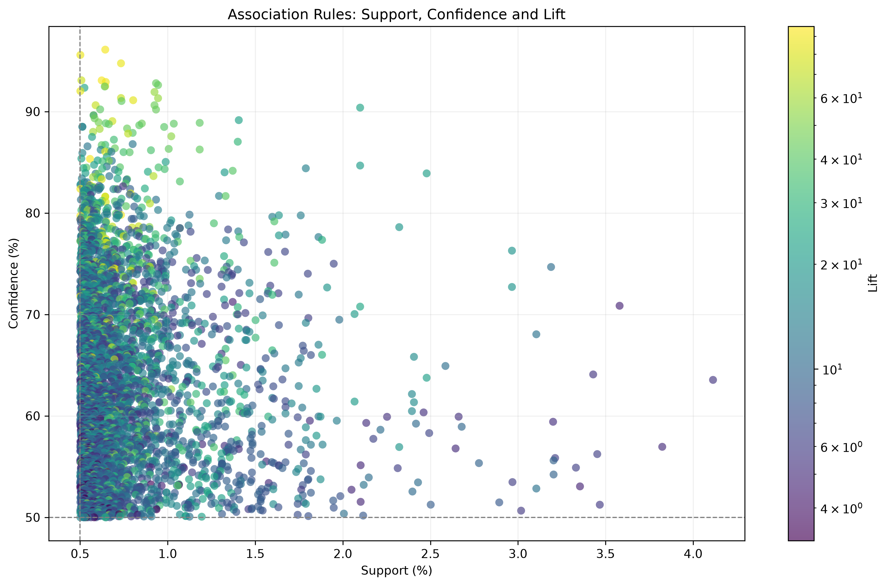
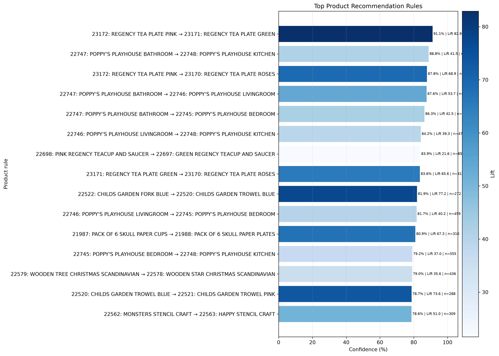
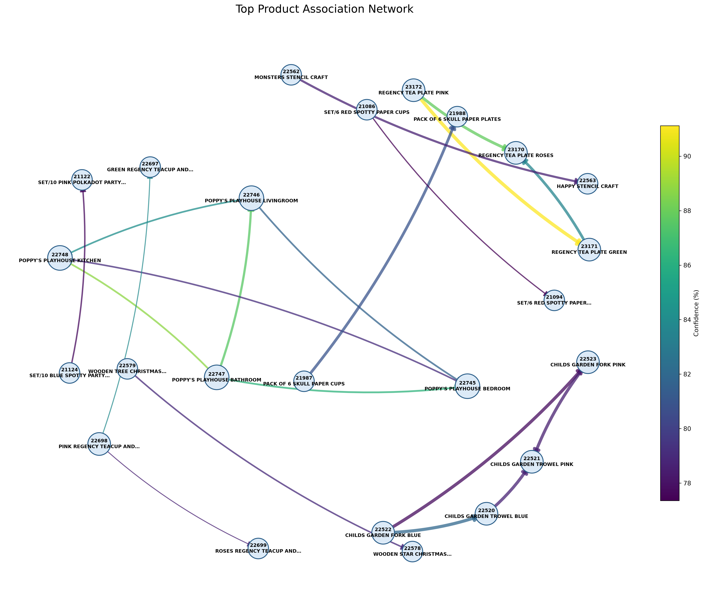

# RetailIQ Market-Basket Analysis Report

## Executive Summary

The RetailIQ market-basket analysis identifies products that customers frequently purchase together. Its purpose is to support cross-selling, product bundles, checkout recommendations, catalogue placement and coordinated inventory planning.

The final analysis used **34,497 eligible multi-product sales invoices** and the **1,000 products appearing in the largest number of invoices**. The resulting sparse invoice-product matrix contained **675,889 product occurrences** with a density of approximately **1.96%**.

FP-Growth was used to discover recurring product combinations. Association rules were then evaluated using support, confidence, lift and basket count. Actionable rules were required to have:

* Minimum support of 0.5%, representing at least approximately 173 eligible baskets.
* Minimum confidence of 50%.
* Minimum lift of 1.20.
* One or two antecedent products.
* One consequent product.

The strongest associations were concentrated around coordinated product collections, complementary items and different variants of related products. Examples observed in the results include children’s garden tools, Regency tableware and coordinated decorative products.

These results provide evidence for recommendation opportunities, but they represent observed co-purchase behaviour rather than causal relationships. Product recommendations and bundles should therefore be validated through controlled business experiments.

## Business Objective

The analysis addresses the following question:

> When a customer purchases one or more products, which additional product is most relevant to recommend?

The results can support:

* Frequently-bought-together recommendations.
* Checkout and basket-level cross-selling.
* Product bundle development.
* Personalized email recommendations.
* Related-product catalogue placement.
* Coordinated inventory availability.
* Targeted promotional testing.

## Data Preparation

Only genuine product-sale activity was used. The preparation rules were:

* Include rows classified as `Sale`.
* Require a positive quantity.
* Exclude exact reversal-pair sales.
* Require a valid invoice and normalized stock code.
* Collapse duplicate invoice-product combinations.
* Select the 1,000 products appearing in the most invoices.
* Exclude invoices containing fewer than two selected products.

An invoice-product combination was represented as a Boolean value. Therefore, purchasing several units of the same product within an invoice counted as one product presence.

Single-product invoices were excluded because they cannot produce a relationship between two products. Consequently, the reported support values describe product behaviour within eligible multi-product transactions.

## Methodology

### Frequent Itemsets

FP-Growth was used to find product combinations appearing in at least 0.5% of eligible baskets. Itemset length was restricted to a maximum of three products to control computation and preserve interpretability.

### Association Rules

Rules were expressed in the following form:

> Antecedent product or products → Consequent product

The rule measures were interpreted as follows:

* **Support:** percentage of eligible baskets containing the complete product combination.
* **Confidence:** percentage of antecedent baskets that also contain the consequent.
* **Lift:** strength of the relationship relative to the consequent product’s normal purchase frequency.
* **Basket count:** number of eligible invoices supporting the complete combination.

A lift greater than one indicates that the product combination occurs more often than expected under independent purchasing behaviour.

Directional rules were retained in the final recommendation table because `Product A → Product B` and `Product B → Product A` may have different confidence values. Reverse pairs were collapsed only for visualization.

## Association-Rule Overview



The figure compares rule coverage and reliability. Rules further to the right occur in more baskets, while rules higher on the chart have greater confidence. Colour represents lift and identifies relationships that occur more frequently than expected from the products’ normal purchase rates.

Rules with extremely high lift may describe strong relationships between less common product variants. These rules should always be assessed together with support and basket count before being used commercially.

## Strongest Product Recommendations



The ranked rules highlight combinations with high recommendation confidence, sufficient transaction support and positive lift.

The strongest relationships frequently connect:

* Products from the same coordinated collection.
* Alternative colours or designs of the same product family.
* Complementary tableware products.
* Coordinated seasonal decorations.
* Related children’s gardening accessories.

These patterns suggest that customers often purchase products as coordinated sets rather than as isolated items.

## Product Association Network



Each node represents a product, and each arrow represents a retained recommendation direction. Edge colour represents confidence, edge thickness represents lift and larger nodes participate in more of the selected relationships.

The network is intentionally restricted to the strongest rules to maintain readability. It is not a complete representation of every association found in the dataset.

## Business Recommendations

### Frequently-Bought-Together Recommendations

Display strongly associated consequent products when an antecedent product is viewed or added to a basket. Recommendations should prioritize rules with:

* High confidence.
* Adequate basket count.
* Lift materially greater than one.
* Products that are currently available.
* Positive commercial margin.

### Product Bundles

Create bundles for coordinated products that repeatedly appear together. Suitable candidates include product collections, complementary tableware, matching decorative items and related accessories.

Bundle discounts should be tested carefully. A strong association may indicate that customers already purchase the products together without an incentive.

### Checkout Cross-Selling

Use single-consequent rules to recommend one additional product during checkout. Recommendations should remain limited and relevant to avoid overwhelming customers.

### Inventory Coordination

Products with strong associations should be monitored together. If an antecedent product is promoted while the associated consequent is unavailable, RetailIQ may lose potential cross-selling revenue.

### Recommendation Testing

Before broad implementation, test selected rules through controlled experiments. Recommended measures include:

* Recommendation click-through rate.
* Add-to-basket rate.
* Conversion rate.
* Average basket value.
* Incremental revenue.
* Gross margin.
* Product return or cancellation rate.

### Customer-Segment Extension

A future extension can compare market-basket behaviour across the previously identified customer segments:

* Dormant / Low Engagement.
* Active Core Customers.
* VIP / High Value.

This would help determine whether high-value customers purchase different combinations from the broader customer base. Segment-specific analysis should only be used where each segment contains enough baskets to produce reliable support.

## Limitations

* The analysis uses historical co-purchase patterns and does not prove causation.
* Results are restricted to the 1,000 most frequently occurring products.
* Support values are conditional on eligible multi-product invoices.
* Seasonal and discontinued products may influence the discovered associations.
* Product availability and stock-outs are not included.
* Product margin and procurement cost are unavailable.
* Relationships may change over time as products and customer preferences change.
* Very high lift can occur for relatively specialized product combinations.
* Rules should not be selected using lift alone; confidence, support and basket count must also be considered.
* The analysis does not currently distinguish between customer segments, countries or seasons.

## Output Files

The analytical outputs are stored under:

```text
data/processed/market_basket/
```

The folder contains:

* `market_basket_summary.csv`
* `product_support.csv.gz`
* `frequent_itemsets.csv.gz`
* `association_rules.csv.gz`
* `visualization_rules.csv`
* `export_manifest.csv`

## Conclusion

The market-basket analysis adds a product-recommendation layer to RetailIQ. It converts invoice-level transaction history into interpretable product relationships that can support cross-selling, bundling and merchandising decisions.

The rules should initially be treated as recommendation candidates. RetailIQ should combine them with product availability, margin information and controlled testing before operational deployment. The model should also be recalculated periodically to capture changes in the product catalogue, seasonality and customer purchasing behaviour.
